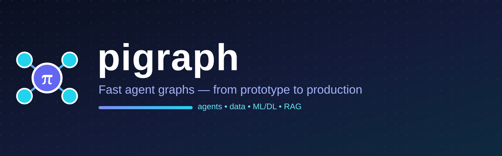

<p align="center">
  
</p>

<p align="center">
  
</p>

<h1 align="center">pigraph</h1>

<p align="center"><strong>Fast agent graphs — from prototype to production.</strong><br/>
LangGraph-compatible API (same names: <code>StateGraph</code>, <code>START</code>, <code>END</code>, <code>Command</code>, <code>Send</code>, <code>interrupt</code>, <code>MemorySaver</code>…), plus batteries for developers, data analysts, and ML/DL teams: databases, ETL, ML nodes, tiny deep learning, and a RAG vector store — with zero hard dependencies.</p>

<p align="center">
  <a href="https://github.com/salim-studio/pigraph"></a>
  =3.9"/>
  
  
  
</p>

> **Renamed:** `pygraph` → **`pigraph`**. Old code keeps working via a compatibility alias (`import pygraph`), but new code should `import pigraph`. See [Migration](#migration-from-pygraph).

## Install

```bash
pip install pigraph
# or from source:
pip install -e .

# optional extras:
pip install "pigraph[db]"    # pandas + sqlalchemy + duckdb
pip install "pigraph[ml]"    # scikit-learn + pandas + numpy
pip install "pigraph[viz]"   # matplotlib
pip install "pigraph[all]"   # everything
```

## Quickstart

```python
from pigraph import StateGraph, START, END, MemorySaver

g = StateGraph(dict)
g.add_node("a", lambda s: {"x": s.get("x", 0) + 1})
g.add_node("b", lambda s: {"y": s["x"] * 2})
g.add_edge(START, "a"); g.add_edge("a", "b"); g.add_edge("b", END)

app = g.compile(checkpointer=MemorySaver())
print(app.invoke({"x": 0}))  # {'x': 1, 'y': 2}
```

## LangGraph compatibility

| LangGraph feature | pigraph |
|---|---|
| `StateGraph` / `MessageGraph` / `START` / `END` | ✅ |
| `add_messages` + `MessagesState` (merge + upsert by `id` + `RemoveMessage`) | ✅ |
| `Command(update, goto)` + `Send(node, arg)` | ✅ |
| `interrupt()` / `Command(resume=...)` (human-in-the-loop) | ✅ |
| `interrupt_before` / `interrupt_after` | ✅ |
| `invoke` / `stream` / `batch` + `ainvoke` / `astream` / `abatch` | ✅ |
| `stream_mode`: `updates` / `values` / `messages` / `debug` | ✅ |
| `get_state` / `get_state_history` / `update_state` | ✅ |
| `MemorySaver` / `SqliteSaver` | ✅ |
| Subgraphs (a node can be a `CompiledGraph`) | ✅ |
| `ToolNode` / `tools_condition` / `create_react_agent` | ✅ (`pigraph.prebuilt`) |
| `@entrypoint` / `@task` | ✅ (`pigraph.functional`) |
| Reducers via `Annotated[list, fn]` | ✅ |

## Examples

### Conditional branching

```python
g = StateGraph(dict)
g.add_node("s", lambda s: {"n": 5})
g.add_node("even", lambda s: {"r": "even"})
g.add_node("odd", lambda s: {"r": "odd"})
g.set_entry_point("s")
g.add_conditional_edges("s", lambda s: "E" if s["n"] % 2 == 0 else "O",
                        {"E": "even", "O": "odd"})
```

### Parallel fan-out with `Send` (runs on a thread pool)

```python
from typing import Annotated, TypedDict

class S(TypedDict, total=False):
    vals: Annotated[list, lambda a, b: (a or []) + b]

g = StateGraph(S)
g.add_node("fan", lambda s: [Send("w", {"i": i}) for i in range(8)])
g.add_node("w", lambda s: {"vals": [s["i"]]})
g.set_entry_point("fan")
```

### Human-in-the-loop

```python
from pigraph import interrupt, Command

def node(s):
    answer = interrupt({"question": "Approve?"})
    return {"answer": answer}

app = g.compile(checkpointer=MemorySaver())
out = app.invoke({"x": 1}, config={"configurable": {"thread_id": "t1"}})
# {'x': 1, '__interrupt__': [{'question': 'Approve?'}]}
out2 = app.invoke(Command(resume="yes"), config={"configurable": {"thread_id": "t1"}})
```

### Ready-made ReAct agent

```python
from pigraph import create_react_agent
app = create_react_agent(model, tools)
app.invoke({"messages": [{"role": "user", "content": "hello"}]})
```

### Functional API

```python
from pigraph import entrypoint, task

@task
def double(x: int): return x * 2

@entrypoint()
def flow(inputs): return {"y": double(inputs["x"]) + 1}

flow.invoke({"x": 3})  # {'y': 7}
```

### Durable checkpoints

```python
from pigraph import SqliteSaver
with SqliteSaver("checkpoints.db") as saver:
    app = g.compile(checkpointer=saver)
```

## 🗄️ Databases (developers & analysts)

`pigraph.db.Database` — one interface: `sqlite` always works, `duckdb` / `sqlalchemy` (e.g. Postgres) light up when installed. Zero hard dependencies.

```python
from pigraph import Database, StateGraph, START, END

db = Database(":memory:")  # or "data.db", "sqlite:///data.db", "duckdb://data.ddb", "postgresql://..."
db.execute("CREATE TABLE sales (id INTEGER, region TEXT, amount TEXT)")
db.executemany("INSERT INTO sales VALUES (?,?,?)", [(1, "cairo", 100), (2, "oran", 200)])
print(db.query("SELECT * FROM sales WHERE amount > 50"))
print(db.tables(), db.schema("sales"))

df = db.query_df("SELECT * FROM sales")  # needs pandas
db.save_df(df, "sales_copy")
db.load_csv("sales.csv", table="sales")

g = StateGraph(dict)
g.add_node("load", db.read_node("SELECT * FROM sales", out_key="rows"))
g.add_node("write", db.write_node("sales_archive", in_key="rows"))
g.add_edge(START, "load"); g.add_edge("load", "write"); g.add_edge("write", END)

from pigraph import JsonFileSaver
app = g.compile(checkpointer=JsonFileSaver("checkpoints.json"))
```

## 🧹 Data & ETL (analysts)

```python
from pigraph import DataPipeline, load_csv, clean_missing, normalize, describe, group_by_agg

rows = load_csv("sales.csv")
print(describe(rows))
rows = clean_missing(rows, strategy="mean")
rows = normalize(rows, columns=["amount"])
print(group_by_agg(rows, by="region", agg="sum", target="amount"))

pipe = DataPipeline()
pipe.add_step(lambda r: clean_missing(r, strategy="mean"))
pipe.add_step(lambda r: normalize(r, columns=["amount"]))
clean = pipe.run(rows)
app = pipe.to_graph(in_key="rows", out_key="dataset")
```

## 🤖 Machine learning (data science)

Works without `scikit-learn` (built-in `MajorityClassifier` / `MeanRegressor` baselines), faster with it.

```python
from pigraph import make_ml_graph, cross_validate, MajorityClassifier

dataset = [{"x": 1, "label": 0}, {"x": 2, "label": 0}, {"x": 9, "label": 1}, {"x": 8, "label": 1}]
app = make_ml_graph(target="label", metrics=("accuracy", "f1"))
out = app.invoke({"dataset": dataset})
print(out["metrics"])

print(cross_validate(MajorityClassifier, dataset, target="label", k=2))
```

## 🧠 Deep learning (lightweight + optional torch)

```python
from pigraph import SimpleMLP, make_dl_node

mlp = SimpleMLP(input_dim=2, hidden=[8], output_dim=1, task="regression")
mlp.fit([[0, 0], [1, 1]], [0, 2], epochs=20)
print(mlp.predict([[2, 2]]))

g.add_node("dl", make_dl_node(target="label", task="binary", epochs=30))
```

## 🔍 RAG memory (LLM developers)

```python
from pigraph import InMemoryVectorStore

store = InMemoryVectorStore()
store.add_texts(["AI is changing the world", "SQL databases", "Machine and deep learning"])
print(store.search("artificial intelligence", k=2))
store.save("kb.json"); store.load("kb.json")

g.add_node("retrieve", store.retrieval_node(in_key="question", out_key="context"))
```

## 📊 Visualization & utilities

```python
from pigraph import graph_to_mermaid, graph_to_ascii, plot_history, TimerCallback, retry

print(graph_to_mermaid(app))  # paste into GitHub for a Mermaid diagram
print(graph_to_ascii(app))
plot_history([0.9, 0.5, 0.2], save="loss.png")

@retry(tries=3, delay=0.2)
def api_node(state): ...
```

## Why fast?

- **No pydantic**: plain-`dict` state; reducers extracted once at build time.
- **Linear fast-path**: single nodes run directly — no thread pool, no routing copies.
- **Static edges** resolved at `compile()`.
- **Deepcopy only at checkpoints** (`MemorySaver`/`SqliteSaver`); streams yield the same objects.
- **Parallel fan-out**: `Send` and branches run on a `ThreadPoolExecutor` (`asyncio.gather` in async paths), `batch` is parallel, `ToolNode` runs tools in parallel.

`benchmarks/bench_pigraph.py` (Windows, 50 nodes × 300): ~259k nodes/s — ~1.5x faster than a heavy baseline (deepcopy + history + validation each step, langgraph-style); fan-out ×8 with 2ms I/O each takes ~6ms parallel instead of ~16ms serial.

## Tests

```bash
python -m pytest tests/ -q
python benchmarks/bench_pigraph.py
```

## Migration from pygraph

```python
# before
from pygraph import StateGraph
# after
from pigraph import StateGraph
```

`import pygraph` still works (it re-exports `pigraph` and emits a `DeprecationWarning`), so existing code doesn't break. But the package on PyPI and GitHub is now **`pigraph`**: https://github.com/salim-studio/pigraph

## Contributing

Issues and PRs are welcome at https://github.com/salim-studio/pigraph. Please run `python -m pytest tests/ -q` before submitting.

## License

MIT — see [LICENSE](LICENSE).
